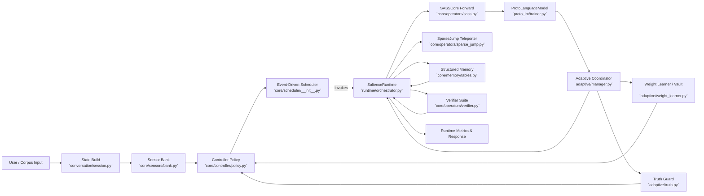

# SalienceOS Seed Architecture Abstract

## Summary
SalienceOS Seed orchestrates a salience-governed runtime around a state-space backbone (`core/operators/sass.py`) instead of a Transformer attention stack. Runtime scheduling, memory maintenance, adaptive gating, and learning loops are coordinated by `runtime/orchestrator.py`, `core/controller/policy.py`, `core/sensors/bank.py`, `adaptive/manager.py`, and `conversation/session.py`. Together these components demonstrate non-Transformer reasoning, control, and learning while still producing conversational outputs via the `ProtoLanguageModel` defined in `proto_lm/trainer.py`.

## High-Level Flowchart

## Why This Is Not a Transformer
- **Backbone:** `SASSCore` replaces multi-head attention with gated depthwise convolutions and recurrent state propagation (`core/operators/sass.py`). Transformers depend on attention matrices for token mixing; SASS maintains per-layer state tensors updated via gates.
- **Scheduling:** Actions are chosen by `SalienceControllerPolicy` using bandit scores, hysteresis, and salience auctions (`core/controller/policy.py`). Transformers execute a fixed stack of identical decoder blocks regardless of context.
- **Salience Sensors:** `SensorBank` emits normalized novelty, uncertainty, progress, drag, cost, coherence, and truth channels from the runtime state and memory (`core/sensors/bank.py`). Transformer pipelines lack runtime sensor feedback loops.
- **Teleportation & Graph Reasoning:** Global recalls occur through `SparseJumpTeleporter` and `GraphReasoner` hooks triggered by salience thresholds (`runtime/orchestrator.py`), not through attention weights.
- **Adaptive Control:** `AdaptiveCoordinator` monitors training snapshots and runtime metrics to adjust controller weights, apply truth/elegance gating, and maintain an adaptive vault (`adaptive/manager.py`). Transformers typically rely on static loss functions without runtime gating.
- **Memory & Maintenance:** Structured memory tables (`core/memory/tables.py`) are curated through maintenance heuristics (`runtime/orchestrator.py` and `core/memory/maintenance.py`), whereas Transformers usually rely on implicit attention-based context.
- **Runtime Decisions:** `runtime/orchestrator.py` can route execution to reflection, verification, or tool ops without invoking SASS at every step, proving the system is not a pure sequence of Transformer blocks.

Given these architectural substitutes, the model’s computation graph differs fundamentally from an attention-based Transformer despite producing language outputs (`ProtoLanguageModel.training_step()` and `.sample()` in `proto_lm/trainer.py`).

## Evidence of Functional Results Without a Transformer
- **Integration Tests:** `tests/test_adaptive_integration.py` validates round-trip persistence, adaptive coordination, and conversation state recovery without invoking Transformer operations.
- **Conversation Flow:** `conversation/session.py` shows responses generated through `ProtoLanguageModel.sample()` conditioned by salience-driven gating and truth checks rather than attention-based decoder layers.
- **Runtime Metrics:** `RuntimeMetrics` includes salience and verification signals (`runtime/orchestrator.py`), demonstrating active control loops absent from Transformer-only stacks.

## End-to-End Explanation (SalienceOS Seed)
- **Input Preparation:** User or corpus text is sanitized, embedded deterministically, and scheduled via `ConversationSession._build_state()` (`conversation/session.py`).
- **Sensor Evaluation:** Each runtime step translates state, scratchpad, and memory context into normalized salience values (`core/sensors/bank.py`), including truth estimates (`core/sensors/truth.py`).
- **Controller Decision:** Salience-driven scoring (S′ engine in `core/controller/s_prime.py`) and bandit adjustments pick among SASS forward passes, verification, tool use, or reflective actions (`core/controller/policy.py`).
- **Runtime Execution:** `runtime/orchestrator.py` executes chosen operators, teleports sparse residuals, performs graph reasoning, updates structured memory, and records maintenance events.
- **Language Core:** When selected, `SASSCore` processes tokens linearly and updates layer states; outputs are decoded through the `ProtoLanguageModel` head (`proto_lm/trainer.py`).
- **Adaptive Feedback:** Training snapshots (`ProtoLanguageModel.training_step()`) and runtime metrics feed into the `AdaptiveCoordinator`, which updates controller weights, truth gating, and elegance decisions (`adaptive/manager.py`).
- **Persistence & Episodes:** The runtime records episodic memories (`core/meta/episodic.py`), keeps verification history, and saves adaptive state for future runs (`conversation/session.py`).

Unlike a Transformer, SalienceOS Seed distributes computation across salience sensors, adaptive controllers, state-space dynamics, and maintenance subsystems. This architecture demonstrates that useful reasoning and language generation can arise without relying on Transformer attention.
